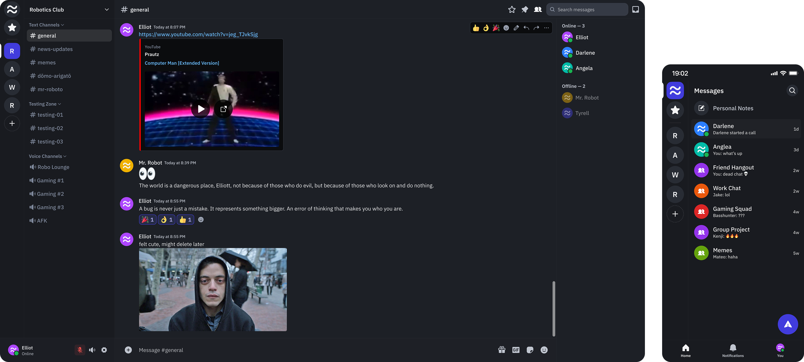

> [!NOTE]
> Learn about the developer behind Fluxer, the goals of the project, the tech stack, and what's coming next.
>
> [Read the launch blog post](https://blog.fluxer.app/how-i-built-fluxer-a-discord-like-chat-app/) · [View full roadmap](https://blog.fluxer.app/roadmap-2026/)

<p align="center">
  
</p>

<p align="center">
  <a href="https://fluxer.app/donate">
    </a>
  <a href="https://docs.fluxer.app">
    </a>
  <a href="./LICENSE">
    </a>
</p>

# Fluxer

Fluxer is a **free and open source instant messaging and VoIP platform** for friends, groups, and communities. Self-host it and every feature is unlocked.

## Quick links

- [Self-hosting guide](https://docs.fluxer.app/self-hosting)
- [Documentation](https://docs.fluxer.app)
- [Donate to support development](https://fluxer.app/donate)
- [Security](https://fluxer.app/security)

## Features



**Real-time messaging** – typing indicators, reactions, and threaded replies.

**Voice & video** – calls in communities and DMs with screen sharing, powered by LiveKit.

**Rich media** – link previews, image and video attachments, and GIF search via KLIPY.

**Communities and channels** – text and voice channels organised into categories with granular permissions.

**Custom expressions** – upload custom emojis and stickers for your community.

**Self-hostable** – run your own instance with full control of your data and no vendor lock-in.

> [!NOTE]
> Native mobile apps and federation are top priorities. If you'd like to support this work, [donations](https://fluxer.app/donate) are greatly appreciated. You can also share feedback by emailing developers@fluxer.app.

## Self-hosting

> [!NOTE]
> New to Fluxer? Follow the [self-hosting guide](https://docs.fluxer.app/self-hosting) for step-by-step setup instructions.

TBD

### Deployment helpers

- [`livekitctl`](./fluxer_devops/livekitctl/README.md) – bootstrap a LiveKit SFU for voice and video

## Development

### Tech stack

- [TypeScript](https://www.typescriptlang.org/) and [Node.js](https://nodejs.org/) for backend services
- [Hono](https://hono.dev/) as the web framework for all HTTP services
- [Erlang/OTP](https://www.erlang.org/) for the real-time WebSocket gateway (message routing and presence)
- [React](https://react.dev/) and [Electron](https://www.electronjs.org/) for the desktop and web client
- [Rust](https://www.rust-lang.org/) compiled to WebAssembly for performance-critical client code
- [SQLite](https://www.sqlite.org/) for storage by default, with optional [Cassandra](https://cassandra.apache.org/) for distributed deployments
- [Meilisearch](https://www.meilisearch.com/) for full-text search and indexing
- [Valkey](https://valkey.io/) (Redis-compatible) for caching, rate limiting, and ephemeral coordination
- [LiveKit](https://livekit.io/) for voice and video infrastructure

### Devenv development environment

Fluxer supports development through **devenv** only. It provides a reproducible Nix environment and a single, declarative process manager for the dev stack.

1. Install Nix and devenv using the [devenv getting started guide](https://devenv.sh/getting-started/).
2. Enter the environment:

```bash
devenv shell
```

If you use direnv, the repo includes a `.envrc` that loads devenv automatically – run `direnv allow` once.

### Getting started

Start all services and the development server with:

```bash
devenv up
```

Open the instance in a browser at your dev server URL (e.g. `http://localhost:48763/`).

Emails sent during development (verification codes, notifications, etc.) are captured by a local Mailpit instance. Access the inbox at your dev server URL + `/mailpit/` (e.g. `http://localhost:48763/mailpit/`).

### Voice on a remote VM

If you develop on a remote VM behind Cloudflare Tunnels (or a similar HTTP-only tunnel), voice and video won't work out of the box. Cloudflare Tunnels only proxy HTTP/WebSocket traffic, so WebRTC media transport needs a direct path to the server. Open these ports on the VM's firewall:

| Port        | Protocol | Purpose          |
| ----------- | -------- | ---------------- |
| 3478        | UDP      | TURN/STUN        |
| 7881        | TCP      | ICE-TCP fallback |
| 50000-50100 | UDP      | RTP/RTCP media   |

The bootstrap script configures LiveKit automatically based on `domain.base_domain` in your `config.json`. When set to a non-localhost domain, it enables external IP discovery so clients can connect directly for media while signaling continues through the tunnel.

### Devcontainer (experimental)

There is experimental support for developing in a **VS Code Dev Container** / GitHub Codespace without Nix. The `.devcontainer/` directory provides a Docker Compose setup with all required tooling and backing services.

```bash
# Inside the dev container, start all processes:
process-compose -f .devcontainer/process-compose.yml up
```

Open the app at `http://localhost:48763` and the dev email inbox at `http://localhost:48763/mailpit/`. Predefined VS Code debugging targets are available in `.vscode/launch.json`.

> [!WARNING]
> Bluesky OAuth is disabled in the devcontainer because it requires HTTPS. All other features work normally.

### Documentation

To develop the documentation site with live preview:

```bash
pnpm dev:docs
```

## Contributing

Fluxer is **free and open source software** licensed under **AGPLv3**. Contributions are welcome.

See [`CONTRIBUTING.md`](./CONTRIBUTING.md) for development processes and how to propose changes, and [`CODE_OF_CONDUCT.md`](./CODE_OF_CONDUCT.md) for community guidelines.

## Security

Report vulnerabilities at [fluxer.app/security](https://fluxer.app/security). Do not use public issues for security reports.

<details>
<summary><strong>License</strong></summary>
<br>

Copyright (c) 2026 Fluxer Contributors

Licensed under the [GNU Affero General Public License v3](./LICENSE):

```text
Copyright (c) 2026 Fluxer Contributors

This program is free software: you can redistribute it and/or modify it under
the terms of the GNU Affero General Public License as published by the Free
Software Foundation, either version 3 of the License, or (at your option) any
later version.

This program is distributed in the hope that it will be useful, but WITHOUT
ANY WARRANTY; without even the implied warranty of MERCHANTABILITY or FITNESS
FOR A PARTICULAR PURPOSE. See the GNU Affero General Public License for more
details.

You should have received a copy of the GNU Affero General Public License along
with this program. If not, see https://www.gnu.org/licenses/
```

See [`LICENSING.md`](./LICENSING.md) for details on commercial licensing and the CLA.

</details>
